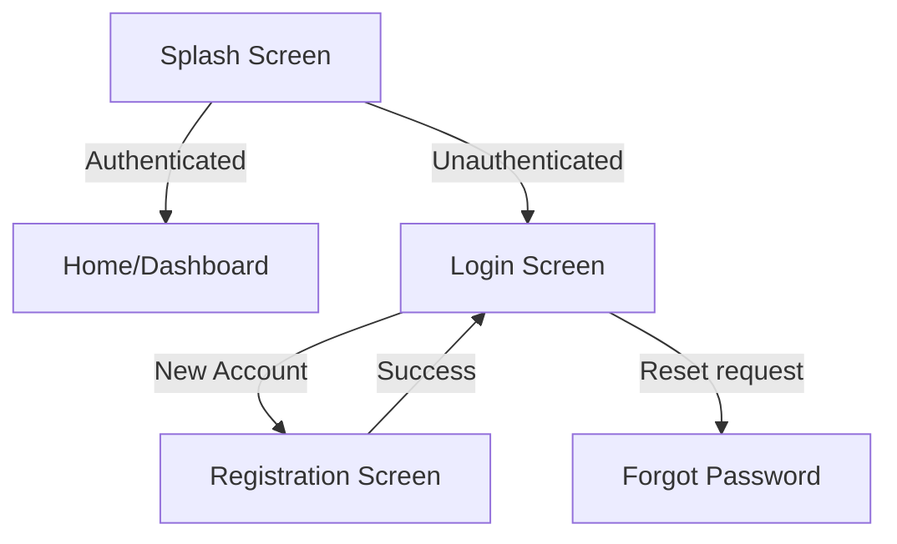
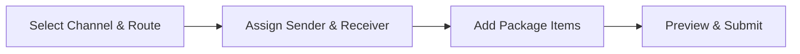

# Shipping Customer Mobile App Plan: Screens & API Specifications

This document outlines the complete architectural layout, screen-by-screen UX specifications, and API integration flows for the Customer Mobile App (iOS & Android).

---

## 📱 1. Screen-by-Screen Blueprint

### 🚪 Launch & Authentication



#### 1. Splash Screen

- **UX Description**: Displays the brand logo and a clean, centered loading animation.
- **Features & Actions**:
    - Initiates startup checks (connection, force update validation, system configs).
    - Retrieves system parameters like currencies, destination countries, and service options.
    - Auto-logs the user in if a valid token is found in the local storage (Secure Storage / Keychain).
- **API Integrations**:
    - `POST /api/startup` (Fetches system settings and checks backend availability).

#### 2. Login Screen

- **UX Description**: A modern, clean login form featuring standard email and password input fields, a "Forgot Password?" link, and a prominent "Login" action button. Social login shortcuts are available at the bottom.
- **Features & Actions**:
    - Field-level email and password validations.
    - Requests device permission for push notifications to retrieve the notification token.
    - Saves the session state and returns lists of destinations (Air, Sea, Land) and saved addresses.
- **API Integrations**:
    - `POST /api/cusLogin` (Validates credentials and registers device push token).

#### 3. Registration Screen (Multi-Step Wizard)

- **UX Description**: A progressive multi-step sign-up flow to keep the form readable and non-intimidating.
- **Steps**:
    - **Step 1: Account Details**: First Name, Last Name, Email, Password, and Password Confirmation.
    - **Step 2: Contact Info**: Phone, Secondary Phone (Optional), Country of Residence, and Detailed Address.
    - **Step 3: Identity Verification (ID Proof)**: Interface to snap or upload a photo of the Passport or National ID.
- **API Integrations**:
    - `POST /api/newCustomer` (Creates the client account and uploads details).

#### 4. Forgot Password Screen

- **UX Description**: A single field input page for the user's email address to request a reset link.
- **Features & Actions**:
    - Generates a secure password reset email request.

---

### 🏠 Dashboard & Tools

#### 5. Home Screen / Dashboard

- **UX Description**: The main central hub of the app. Displays a personalized greeting card at the top, a quick action grid, summary status badges, and a scrollable list of recent shipments.
- **Features & Actions**:
    - **Stat Badges**: Count of _Pending Requests_, _Active Shipments_, and _Delivered Shipments_.
    - **Quick Actions**:
        - Create Shipping Request
        - Rates Calculator
        - Live Track
        - Support & Help Center
    - **Recent Shipments**: List showing the last 3 shipping requests with current statuses.
- **API Integrations**:
    - `POST /api/getCusRequests` (Retrieves request records).

#### 6. Rates Calculator Screen

- **UX Description**: Interactive calculator form allowing customers to estimate rates before submitting a request.
- **Features & Actions**:
    - Select origin and destination countries.
    - Select shipping channel type (Air Freight, Sea Cargo, Land Freight).
    - Enter total estimated package weight in kilograms (kg).
    - Calculate estimates on the fly with local/preferred currencies list.
- **API Integrations**:
    - `POST /api/ratesCalculator` (Runs pricing calculations based on admin tariffs).

---

### 📦 Shipping & Tracking



#### 7. Create Shipping Request (Wizard)

- **UX Description**: A clean 4-step wizard to guide customers through request creation.
- **Steps**:
    - **Step 1: Channel & Route**: Select channel (Air, Sea, Land), Service Type (e.g. Clearance, standard), Container Type, Origin Country, and Destination Country.
    - **Step 2: Sender & Receiver**: Input fields for Sender and Receiver details (Name, Phone, Address). Includes a "Choose Saved" address book shortcut.
    - **Step 3: Package Details**: Dynamic list creator where users tap "Add Item" to supply Item Name, Type (dropdown), and Weight (kg) for multiple boxes/packages.
    - **Step 4: Summary & Submit**: Summary showing routes, receiver, package count, total weight, and optional instruction text fields. Submit button sends the payload.
- **API Integrations**:
    - `POST /api/newShippingRequest` (Saves shipment request and triggers backend processing).

#### 8. My Requests & Shipments List

- **UX Description**: A tabbed list displaying all historical shipping operations.
- **Tabs**:
    - **Pending**: Requests waiting for inspection, approval, or pricing confirmation.
    - **Active**: Live shipments currently in transit.
    - **Archived**: Completed or cancelled shipments.
- **Features & Actions**:
    - Pulldown to refresh list.
    - Tap any card to view detailed progress.
- **API Integrations**:
    - `POST /api/getCusRequests` (Retrieves historical records).

#### 9. Live Tracking & Details Screen

- **UX Description**: A screen featuring a step timeline tracker at the top, followed by shipment details cards, sender/receiver info blocks, and itemized packages.
- **Features & Actions**:
    - Visual progress timeline showing states: _Pending Approval_ -> _Received in Warehouse_ -> _Dispatched_ -> _In Transit_ -> _Out for Delivery_ -> _Delivered_.
    - Live movements logs showing scan timestamps and location descriptions.
    - Prints tracking number (TNO) with a copy-to-clipboard button.
- **API Integrations**:
    - `POST /api/trackingShipment` (Retrieves shipment state and tracking timeline).

---

### ⚙️ Settings & Profile

#### 10. Profile & Settings

- **UX Description**: Settings page containing account update actions, password modifications, language selector, and an address book manager.
- **Features & Actions**:
    - Update account profile info (Phone, Email, Address, etc.).
    - Reset Password page.
    - Toggle App Language (Arabic / English).
- **API Integrations**:
    - `POST /api/updateBasic` (Saves profile fields).
    - `POST /api/updatePassword` (Updates password credentials).

---

## 🔌 2. API Integration Reference

All endpoint payloads use JSON formatting. Authentication parameters should be stored securely.

### 🌐 Global Headers

```http
Content-Type: application/json
Accept: application/json
```

### 📋 Standard Error Response

All endpoints return a consistent error shape when validation fails:

```json
{
    "status": "Validation failed: <reason>",
    "stype": "danger",
    "data": []
}
```

---

### 🔑 Endpoint 1: App Startup Configuration

Retrieves general system configuration, app versioning, maintenance flags, and contact parameters.

- **URL**: `/api/startup`
- **Method**: `GET` or `POST` _(both supported)_
- **Request Body**: _(None)_
- **Success Response (`200 OK`)**:
    ```json
    {
        "appSettingStatus": 1,
        "appSettings": {
            "id": 1,
            "app_version": "2.1.0",
            "force_update": 0,
            "contact_phone": "+1234567890",
            "contact_email": "support@shipping.com",
            "terms_link": "https://shipping.com/terms",
            "power": "on",
            "power_en": null,
            "power_ar": null,
            "version": "2.1.0",
            "old": "off",
            "old_en": "Please update your app",
            "old_ar": "يرجى تحديث التطبيق",
            "link": "https://play.google.com/store/apps/details?id=com.shipping",
            "legals_en": "Terms and conditions text",
            "legals_ar": "نص الشروط والأحكام",
            "cs": "+1234567890",
            "wsid": "1"
        }
    }
    ```
- **No Settings Found (`200 OK`)**:
    ```json
    {
        "appSettingStatus": 0,
        "appSettings": null
    }
    ```

> **Field Reference**
> | Field | Description |
> |---|---|
> | `appSettingStatus` | Count of settings records (`1` = found, `0` = none) |
> | `app_version` | Latest app version string |
> | `force_update` | `1` = force update required, `0` = optional |
> | `contact_phone` | Customer service phone (`cs` field) |
> | `contact_email` | Support email from server mail config |
> | `terms_link` | URL to update page / Play Store link |
> | `power` | App availability: `"on"` = open, `"off"` = closed |
> | `power_en` / `power_ar` | Closure reason in English / Arabic |
> | `old` | Force old version to update: `"on"` = required |

---

### 👤 Endpoint 2: Customer Login

Authenticates credentials and returns user details alongside shipping destinations and saved address book.

- **URL**: `/api/cusLogin`
- **Method**: `POST`
- **Validation**: `email` and `password` are required.
- **Request Body**:
    ```json
    {
        "email": "customer@email.com",
        "password": "plain_password_string",
        "app": "android",
        "token": "firebase_fcm_push_token_here",
        "lang": "en"
    }
    ```
- **Success Response (`200 OK`)**:
    ```json
    {
        "status": "success",
        "stype": "success",
        "data": {
            "id": 12,
            "first": "John",
            "last": "Doe",
            "email": "customer@email.com",
            "phone": "+1234567890",
            "country": "Egypt",
            "address": "Cairo, Egypt",
            "token": "firebase_fcm_push_token_here",
            "sysLists": [],
            "AirDest": [
                {
                    "id": 1,
                    "type": "1",
                    "destinations": "Cairo Airport",
                    "ar": "مطار القاهرة",
                    "status": "1"
                }
            ],
            "SeaDest": [
                {
                    "id": 3,
                    "type": "2",
                    "destinations": "Alexandria Port",
                    "ar": "ميناء الإسكندرية",
                    "status": "1"
                }
            ],
            "LandDest": [
                {
                    "id": 4,
                    "type": "3",
                    "destinations": "Land Crossing 1",
                    "ar": "منفذ بري 1",
                    "status": "1"
                }
            ],
            "addresses": [
                {
                    "id": 1,
                    "did": 1,
                    "name": "Main Office",
                    "country": "Cairo Airport",
                    "address": "Main Office",
                    "en": "Main Office",
                    "ar": "المكتب الرئيسي",
                    "phone1": "+20123456789",
                    "phone2": null
                }
            ]
        }
    }
    ```
- **Validation Error Response (`200 OK`)**:
    ```json
    {
        "status": "Email and password are required.",
        "stype": "danger",
        "data": []
    }
    ```
- **Invalid Credentials (`200 OK`)**:
    ```json
    {
        "status": "Login failed Email/Password Not Correct.",
        "stype": "danger",
        "data": []
    }
    ```

> **Notes**
>
> - `addresses[].name` and `addresses[].address` are both mapped from the `en` (English name) field.
> - `addresses[].country` is resolved from the linked shipping destination name.
> - On successful login, `lang`, `use`, `token`, and `last_login` fields are updated in the database.

---

### 📝 Endpoint 3: Customer Registration

Registers a new customer account with full validation.

- **URL**: `/api/newCustomer`
- **Method**: `POST`
- **Validation**: `firstName`, `lastName`, `email`, `phone`, `password` are all required. `password` minimum length is 6 characters.
- **Request Body**:
    ```json
    {
        "firstName": "Jane",
        "lastName": "Smith",
        "email": "jane.smith@email.com",
        "phone": "+20123456789",
        "country": "Egypt",
        "address": "Maadi, Cairo",
        "location": "30.0444,31.2357",
        "password": "secure_password",
        "getway": "2",
        "app": "android"
    }
    ```
- **Success Response (`200 OK`)**:
    ```json
    {
        "scode": "1",
        "status": "Account created successfully, login to verify account",
        "stype": "success",
        "data": []
    }
    ```
- **Duplicate Email (`200 OK`)**:
    ```json
    {
        "scode": "2",
        "status": "Email is already exisit",
        "stype": "danger",
        "data": []
    }
    ```
- **Validation Failed (`200 OK`)**:
    ```json
    {
        "scode": "0",
        "status": "Validation failed: The first name field is required.",
        "stype": "danger",
        "data": []
    }
    ```
- **Creation Failed (`200 OK`)**:
    ```json
    {
        "scode": "0",
        "status": "Account creation failed, try again later",
        "stype": "danger",
        "data": []
    }
    ```

> **Response Codes (`scode`)**
> | Code | Meaning |
> |---|---|
> | `"1"` | Account created successfully |
> | `"2"` | Email already exists |
> | `"0"` | Creation failed or validation error |

---

### 📊 Endpoint 4: Rates Calculator

Estimates freight prices based on admin-configured weight range tariffs and routes.

- **URL**: `/api/ratesCalculator`
- **Method**: `POST`
- **Request Body**:
    ```json
    {
        "shippingType": "1",
        "countryFrom": "1",
        "countryTo": "2",
        "weight": 25.5
    }
    ```
- **Success Response (`200 OK`)**:
    ```json
    {
        "totalPrice": 127.5,
        "currList": [
            {
                "id": 1,
                "currency": "USD",
                "value": "1",
                "dollarRate": "1.00"
            },
            {
                "id": 2,
                "currency": "AED",
                "value": "3.67",
                "dollarRate": "3.67"
            }
        ]
    }
    ```

> **Shipping Type Values**
> | Value | Channel |
> |---|---|
> | `"1"` | Air Freight |
> | `"2"` | Sea Cargo |
> | `"3"` | Land Freight |

> **Notes**
>
> - `totalPrice` is calculated by matching weight against the configured tariff ranges (`weight_from` → `Weight_to`).
> - If weight falls outside all defined ranges, the price of the last (highest) range is applied as a fallback.
> - `countryFrom` and `countryTo` are numeric IDs referencing the countries table.

---

### 📦 Endpoint 5: Create Shipping Request / Order

Creates a shipping request, registers sender/receiver details, and stores packages list. All required fields are validated before saving.

- **URL**: `/api/newShippingRequest`
- **Method**: `POST`
- **Required Fields**: `cuid`, `sender`, `senderPhone`, `receiver`, `receiverPhone`, `shippType`, `fromCountry`, `toCountry`, `totalWeight`, `name[]`, `type[]`, `weight[]`
- **Request Body**:
    ```json
    {
        "cuid": 12,
        "sender": "John Doe",
        "senderPhone": "+1234567890",
        "receiver": "Jane Smith",
        "receiverPhone": "+20123456789",
        "receiverPhone2": "+20987654321",
        "shippType": "1",
        "containerType": "2",
        "serviceType": "3",
        "fromCountry": "1",
        "toCountry": "2",
        "getway": "2",
        "getwayType": "2",
        "totalWeight": 45.0,
        "step": "1",
        "note": "Fragile items inside",
        "name": ["Box 1 - Clothes", "Box 2 - Books"],
        "type": ["1", "3"],
        "weight": [20.0, 25.0]
    }
    ```
- **Success Response (`200 OK`)**:
    ```json
    {
        "status": "Shipping Request Saved Successfully",
        "stype": "success",
        "data": []
    }
    ```
- **Validation Failed (`200 OK`)**:
    ```json
    {
        "status": "Validation failed: The cuid field is required.",
        "stype": "danger",
        "data": []
    }
    ```

> **Notes**
>
> - `name`, `type`, and `weight` must be parallel arrays of the same length (one entry per package/box).
> - `req_status` is auto-set to `"4"` (Waiting) on creation.
> - A unique tracking number (`tno`) is auto-generated and stored.
> - `shid` is initialized as `"-1"` until assigned to a shipment container by an admin.

---

### 🔍 Endpoint 6: Fetch Requests & Shipments History

Retrieves all shipping requests and their package contents linked to a customer account.

- **URL**: `/api/getCusRequests`
- **Method**: `POST`
- **Request Body**:
    ```json
    {
        "cid": 12
    }
    ```
- **Success Response (`200 OK`)**:
    ```json
    [
        {
            "id": 105,
            "tno": "SH-90812739",
            "sh_type": "1",
            "sh_ar": "شحن جوي",
            "sh_en": "Air Freight",
            "req_status": "2",
            "status_ar": "مقبول",
            "status_en": "Accepted",
            "from": "1",
            "fromEn": "Cairo Airport",
            "fromAr": "مطار القاهرة",
            "to": "2",
            "toEn": "Dubai Airport",
            "toAr": "مطار دبي",
            "total_weight": "45.00",
            "total_price": "225.00",
            "shid": "32",
            "created_at": "2026-06-16T10:00:00.000000Z",
            "create_at": "Tue, 16 Jun 2026",
            "content": [
                {
                    "id": 204,
                    "rid": 105,
                    "name": "Box 1 - Clothes",
                    "ptype": "1",
                    "cat_en": "Clothing",
                    "cat_ar": "ملابس",
                    "weight": "20.00"
                },
                {
                    "id": 205,
                    "rid": 105,
                    "name": "Box 2 - Books",
                    "ptype": "3",
                    "cat_en": "Books",
                    "cat_ar": "كتب",
                    "weight": "25.00"
                }
            ]
        }
    ]
    ```

> **Request Status Values (`req_status`)**
> | Value | Status EN | Status AR |
> |---|---|---|
> | `"1"` | Waiting | انتظار |
> | `"2"` | Accepted | مقبول |
> | `"3"` | Rejected | مرفوض |
> | `"4"` | Postponed | مؤجل |

---

### 📍 Endpoint 7: Tracking & Timeline Updates

Gets real-time tracking logs and movement timeline for a request by Tracking Number.

- **URL**: `/api/trackingShipment`
- **Method**: `POST`
- **Validation**: `TNO` is required.
- **Request Body**:
    ```json
    {
        "TNO": "SH-90812739"
    }
    ```
- **Success Response — Shipped (`200 OK`, `resultCode: "1"`)**:
    ```json
    {
        "resultCode": "1",
        "resultStatus": {
            "en": "Shipment tracked successfully",
            "ar": "تم تتبع الشحنة بنجاح"
        },
        "shipmentMovements": [
            {
                "status": "In Transit",
                "details": "Shipment departed transit facility",
                "location": "Transit Port A",
                "timestamp": "2026-06-17 12:00:00"
            },
            {
                "status": "Pending",
                "details": "Package scanned at sorting warehouse",
                "location": "Origin Warehouse",
                "timestamp": "2026-06-20 09:00:00"
            }
        ]
    }
    ```
- **Success Response — Not Yet Shipped (`200 OK`, `resultCode: "2"`)**:
    ```json
    {
        "resultCode": "2",
        "resultStatus": {
            "en": "The shipment has not been shipped yet",
            "ar": "لم يتم شحن الشحنة بعد"
        },
        "shipmentMovements": []
    }
    ```
- **Not Found (`200 OK`, `resultCode: "-1"`)**:
    ```json
    {
        "resultCode": "-1",
        "resultStatus": {
            "en": "There is no request for this number",
            "ar": "لا يوجد طلب لهذا الرقم"
        },
        "shipmentMovements": []
    }
    ```
- **Missing TNO (`200 OK`, `resultCode: "-1"`)**:
    ```json
    {
        "resultCode": "-1",
        "resultStatus": {
            "en": "Tracking number is required.",
            "ar": "رقم التتبع مطلوب."
        },
        "shipmentMovements": []
    }
    ```

> **Result Codes**
> | Code | Meaning |
> |---|---|
> | `"1"` | Shipment found and tracked (may or may not have movements yet) |
> | `"2"` | Request exists but not yet assigned to a shipment container |
> | `"-1"` | No request found for this tracking number / validation error |

> **Movement `status` Values**
> | Value | Meaning |
> |---|---|
> | `"In Transit"` | Movement date has passed (completed step) |
> | `"Pending"` | Movement date is in the future (upcoming step) |

---

### 👤 Endpoint 8: Update Profile Basic Info

Allows customers to update their core profile fields. Email and phone must be unique across all accounts (excluding the current user).

- **URL**: `/api/updateBasic`
- **Method**: `POST`
- **Validation**: `cid`, `fname`, `lname`, `email`, `phone` are required. `email` and `phone` must be unique per customer (ignoring own record).
- **Request Body**:
    ```json
    {
        "cid": 12,
        "fname": "John",
        "lname": "Doe",
        "email": "john.newemail@email.com",
        "phone": "+1234567890",
        "phone2": "+1098765432",
        "country": "Egypt",
        "addr": "New Cairo, Egypt",
        "location": "30.0444,31.2357",
        "app": "android"
    }
    ```
- **Success Response (`200 OK`)**:
    ```json
    {
        "status": "Your basic information updated successfully",
        "stype": "success",
        "data": []
    }
    ```
- **Validation Failed (`200 OK`)**:
    ```json
    {
        "status": "Validation failed: The email has already been taken.",
        "stype": "danger",
        "data": []
    }
    ```

> **Notes**
>
> - `addr` is used for the address field (not `address`).
> - Email and phone uniqueness are checked against all other customers — the current customer's own record is excluded from the unique check.

---

### 🔒 Endpoint 9: Change Password

Verifies the current password and updates to the new one. Confirmation field must match the new password.

- **URL**: `/api/updatePassword`
- **Method**: `POST`
- **Validation**: `cid` (must exist), `pass` (current password), `newPass` (min 6 chars), `newPass_confirmation` (must match `newPass`).
- **Request Body**:
    ```json
    {
        "cid": 12,
        "pass": "old_password_string",
        "newPass": "secure_new_password_123",
        "newPass_confirmation": "secure_new_password_123",
        "app": "android"
    }
    ```
- **Success Response (`200 OK`)**:
    ```json
    {
        "status": "Password changed successfully",
        "stype": "success",
        "data": []
    }
    ```
- **Wrong Old Password (`200 OK`)**:
    ```json
    {
        "status": "Your old password not correct...",
        "stype": "danger",
        "data": []
    }
    ```
- **Validation Failed (`200 OK`)**:
    ```json
    {
        "status": "Validation failed: The new pass confirmation does not match.",
        "stype": "danger",
        "data": []
    }
    ```

> **Notes**
>
> - `newPass_confirmation` must exactly match `newPass` — validation is enforced server-side.
> - Passwords are stored as MD5 hashes. Ensure the plain-text password is sent; hashing is done on the server.
> - `cid` must reference an existing customer record or the request will fail validation.
